## 1. Preparation tasks

### Table with connection of 16 slide switches and 16 LEDs on Nexys A7 board

| **LED** | **Connection** | **Switch** | **Connection** | 
| :-: | :-: | :-: | :-: |
| LED0 | H17 | SW0 | J15 |
| LED1 | K15 | SW1 | L16 |
| LED2 | J13 | SW2 | M13 |
| LED3 | N14 | SW3 | R15 |
| LED4 | R18 | SW4 | R17 |
| LED5 | V17 | SW5 | T18 |
| LED6 | U17 | SW6 | U18 |
| LED7 | U16 | SW7 | R13 |
| LED8 | V16 | SW8 | T8 |
| LED9 | T15 | SW9 | U8 |
| LED10 | U14 | SW10 | R16 |
| LED11 | T16 | SW11 | T13 |
| LED12 | V15 | SW12 | H6 |
| LED13 | V14 | SW13 | U12 |
| LED14 | V12 | SW14 | U11 |
| LED15 | V11 | SW15 | V10 |

## 2. Two-bit wide 4-to-1 multiplexer
### VHDL architecture (`mux_2bit_4to1.vhd`)
```vhdl
architecture Behavioral of mux_2bit_4to1 is
begin

    f_o <= a_i when (sel_i = "00") else
           b_i when (sel_i = "01") else
           c_i when (sel_i = "10") else
           d_i; 
        
end architecture Behavioral;
```

### VHDL stimulus process (`tb_mux_2bit_4to1.vhd`)
```vhdl
p_stimulus : process
    begin

        -- Report a note at the begining of stimulus process
        report "Stimulus process started" severity note;

        s_d <= "00"; s_c <= "00"; s_b <= "00"; s_a <= "00"; s_sel <= "00"; wait for 50 ns;

	s_a <= "00"; wait for 50 ns;
        s_b <= "01"; wait for 50 ns;

	s_sel <= "01"; wait for 50 ns;
        s_c <= "00"; wait for 50 ns;
        s_b <= "11"; wait for 50 ns;

      	s_d <= "11";  s_c <= "11"; s_b <= "01"; s_a <= "00";
       	s_sel <= "10"; wait for 50 ns;

      	s_d <= "00";  s_c <= "00"; s_b <= "00"; s_a <= "01";
       	s_sel <= "10"; wait for 50 ns;

     	s_d <= "11";  s_c <= "11"; s_b <= "01"; s_a <= "00";
       	s_sel <= "11"; wait for 50 ns;

	-- Report a note at the end of stimulus proces
        report "Stimulus process finished" severity note;

        wait;
    end process p_stimulus;
```

### Screenshot with simulated time waveforms


## 3. A vivado tutorial

### New project

1. <b>create new project</b>
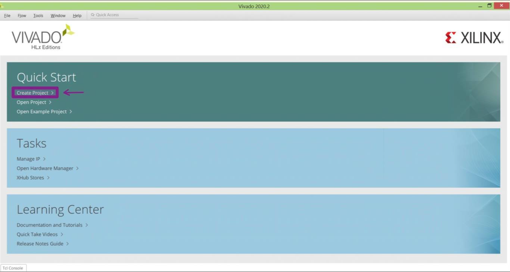

2. <b>next</b>
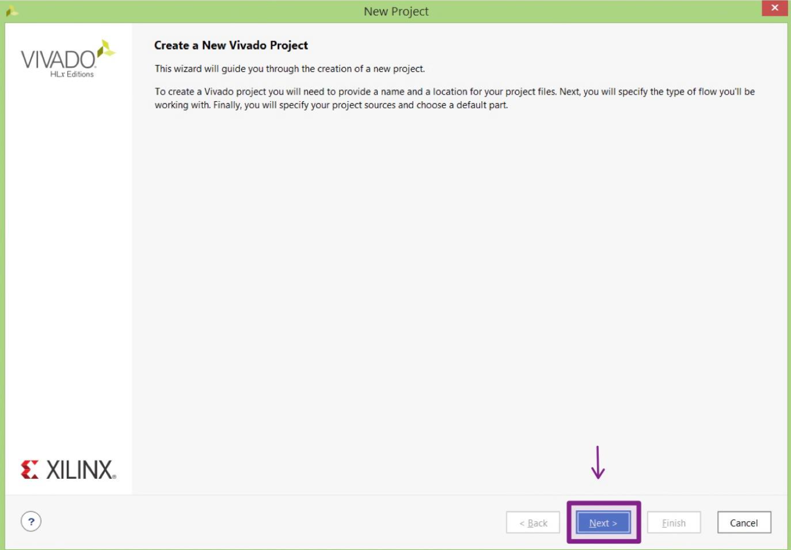

3. project name -> <b>next</b>
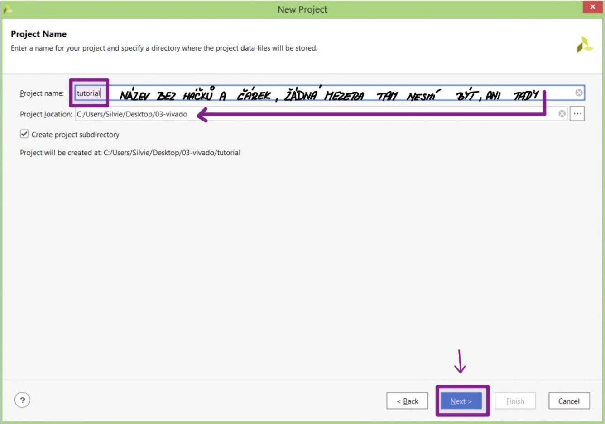

4. check <b>RTL Project</b> -> <b>next</b>
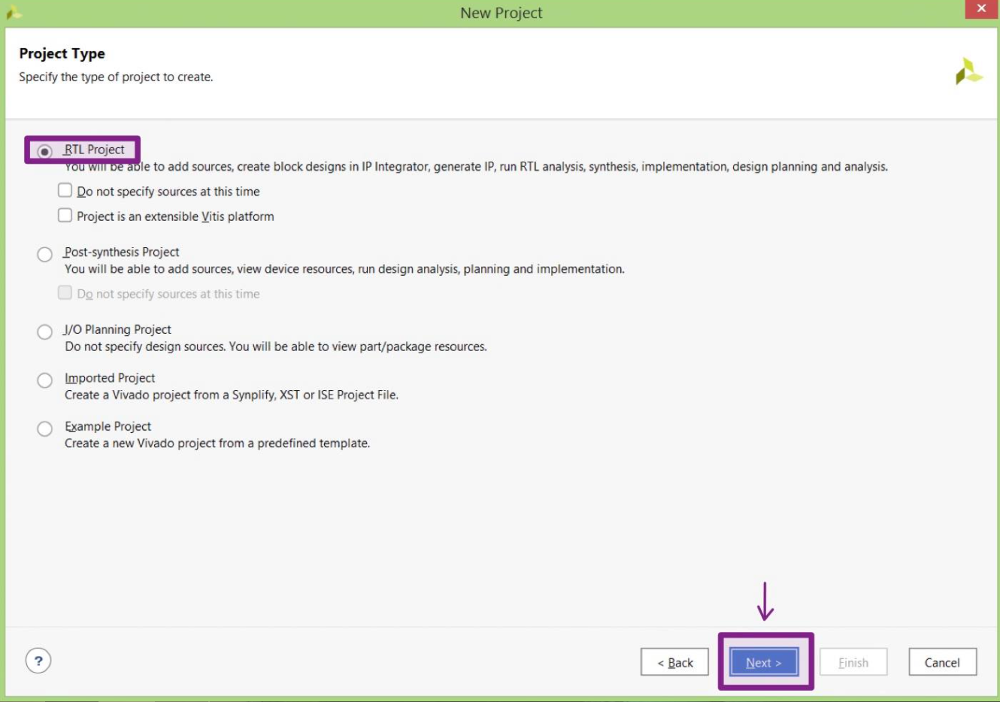

5. <b>create file</b> -> file type = <b>VHDL</b> -> file name -> <b>ok</b> -> <b>next</b>
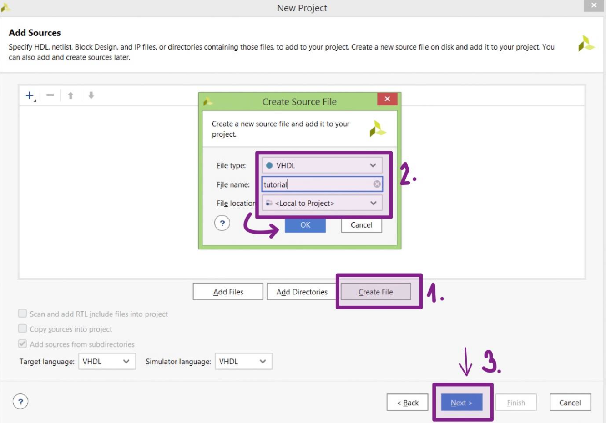

6. <b>next</b>
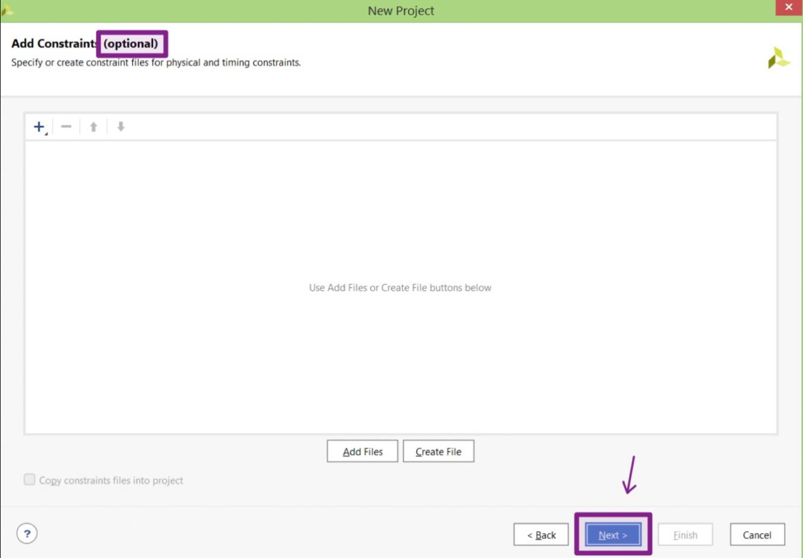

7. click on <b>boards</b> -> find and click on <b>nexys a7-50t</b> -> <b>next</b>
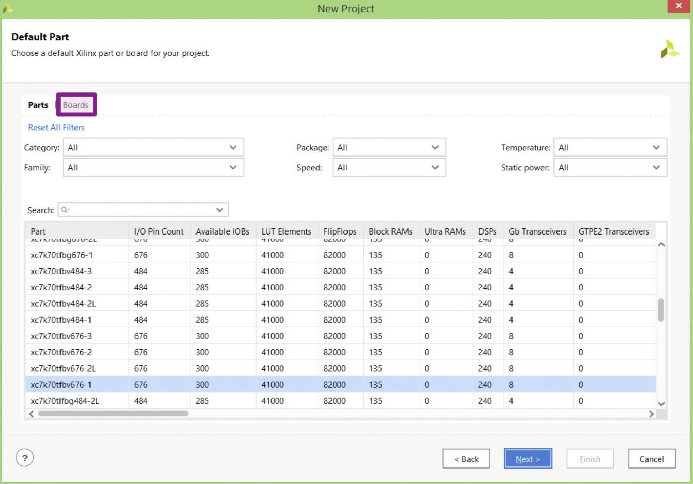
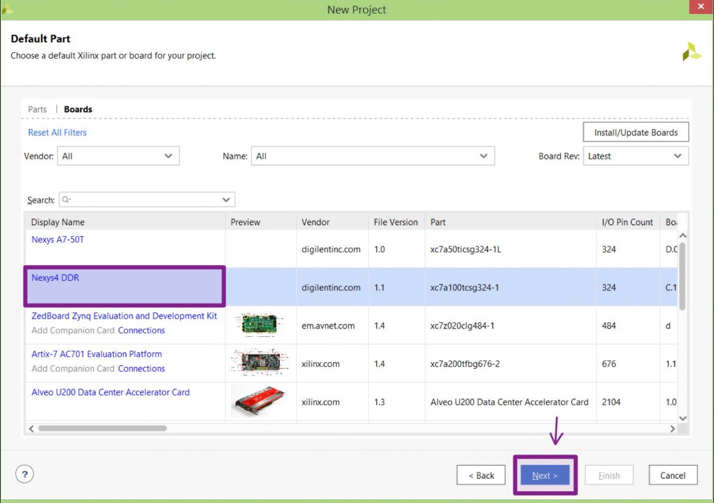

8. <b>finish</b>
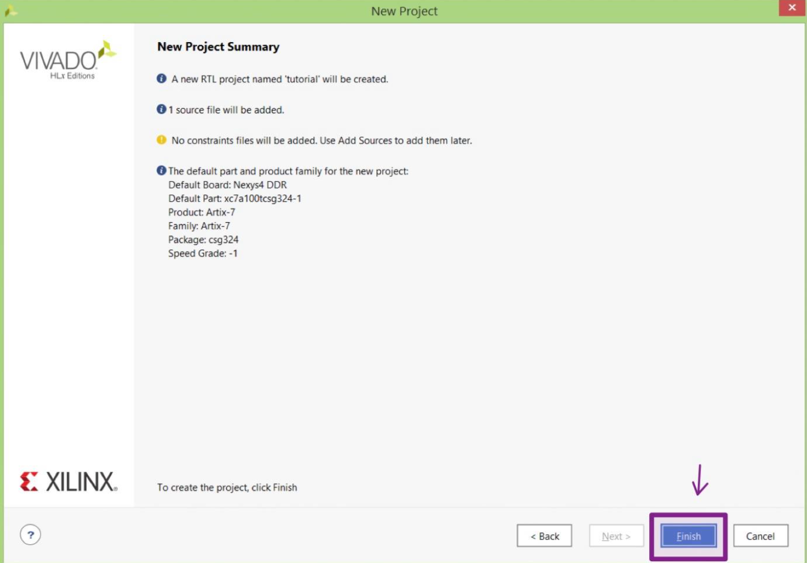

9. wait, then <b>ok</b>
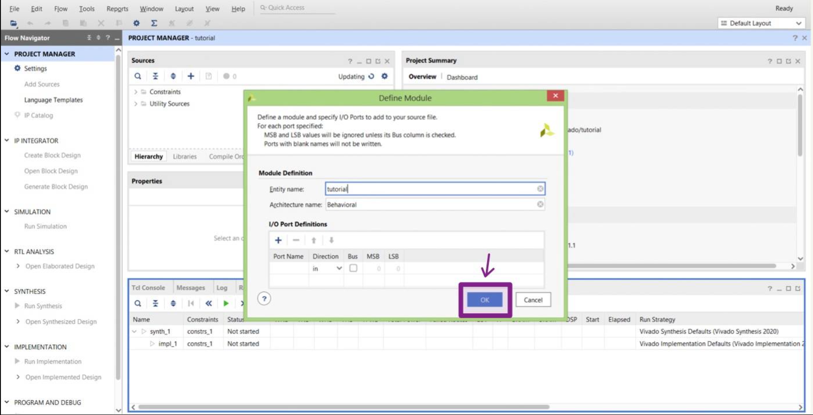

### New simulation source

1. <b>file</b> -> <b>add sources...</b> / or just <b>alt+a</b><br>
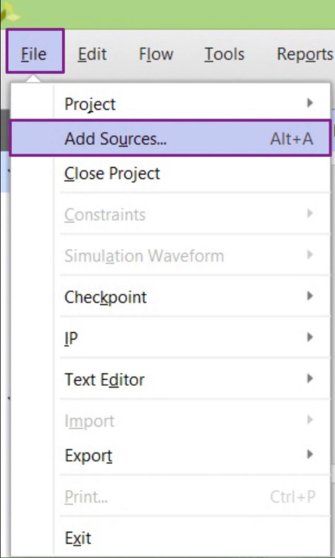

3. <b>add or create simulation sources</b> -> <b>next</b>
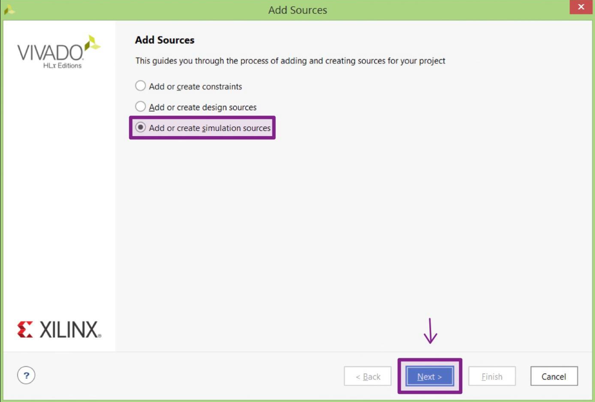

4. <b>create file</b> -> file type = <b>VHDL</b> -> <b>tb_</b>projectname -> <b>ok</b> -> <b>finish</b>
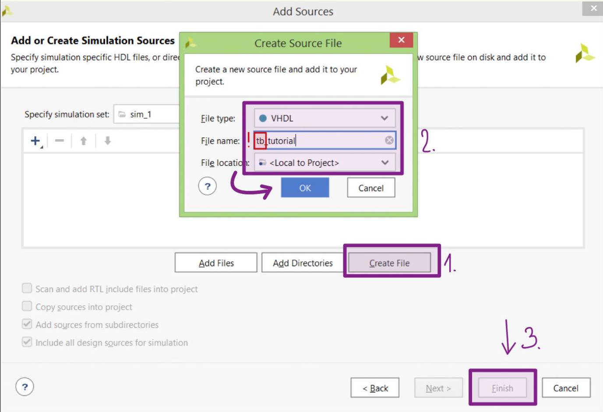

5. done
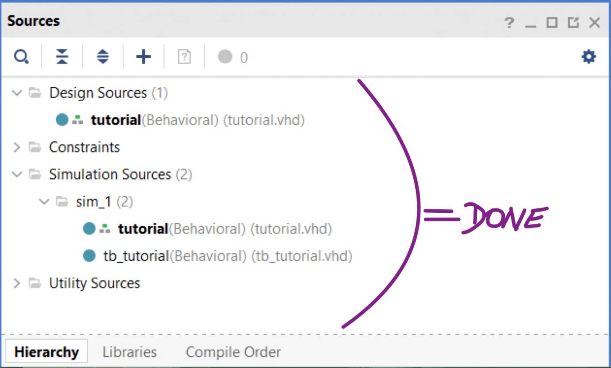

