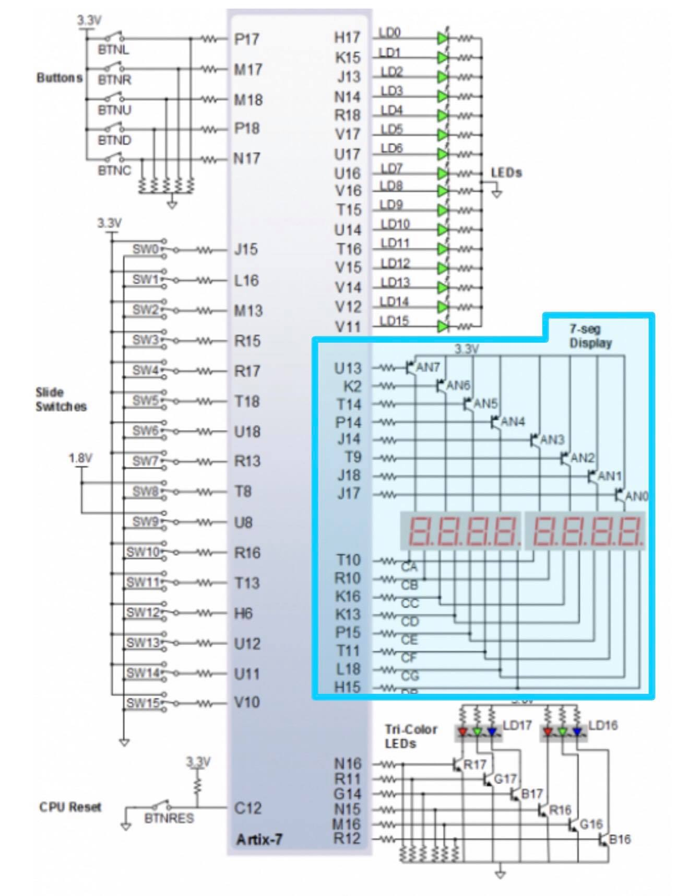
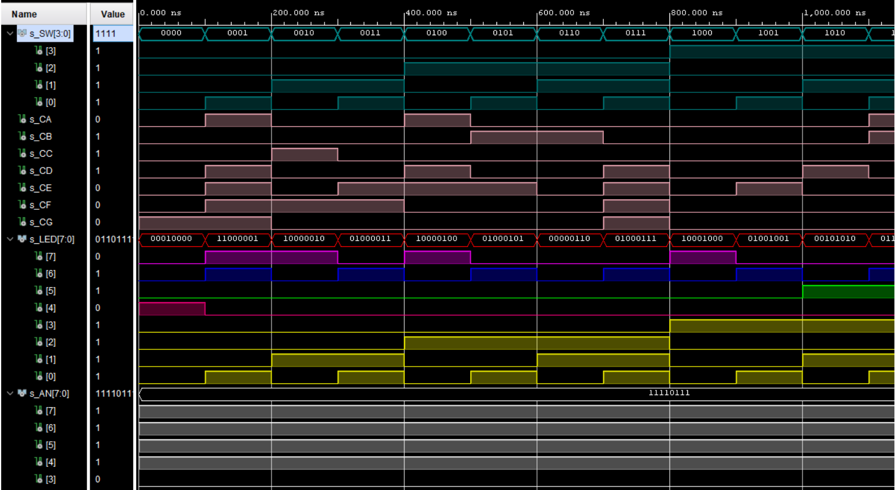

## 1. Preparation tasks
### Figure or table with connection of 7-segment displays on Nexys A7 board

### Decoder truth table for common anode 7-segment display
| Hex | Inputs | A | B | C | D | E | F | G |
| :-: | :-: | :-: | :-: | :-: | :-: | :-: | :-: | :-: |
| 0 | 0000 | 0 | 0 | 0 | 0 | 0 | 0 | 1 |
| 1 | 0001 | 1 | 0 | 0 | 1 | 1 | 1 | 1 |
| 2 | 0010 | 0 | 0 | 1 | 0 | 0 | 1 | 0 |
| 3 | 0011 | 0 | 0 | 0 | 0 | 1 | 1 | 0 |
| 4 | 0100 | 1 | 0 | 0 | 1 | 1 | 0 | 0 |
| 5 | 0101 | 0 | 1 | 0 | 0 | 1 | 0 | 0 |
| 6 | 0110 | 0 | 1 | 0 | 0 | 0 | 0 | 0 |
| 7 | 0111 | 0 | 0 | 1 | 1 | 1 | 1 | 1 |
| 8 | 1000 | 0 | 0 | 0 | 0 | 0 | 0 | 0 |
| 9 | 1001 | 0 | 0 | 0 | 0 | 1 | 0 | 0 |
| A | 1010 | 0 | 0 | 0 | 1 | 0 | 0 | 0 |
| b | 1011 | 1 | 1 | 0 | 0 | 0 | 0 | 0 |
| C | 1100 | 0 | 1 | 1 | 0 | 0 | 0 | 1 |
| d | 1101 | 1 | 0 | 0 | 0 | 0 | 1 | 0 |
| E | 1110 | 0 | 1 | 1 | 0 | 0 | 0 | 0 |
| F | 1111 | 0 | 1 | 1 | 1 | 0 | 0 | 0 |

## 2. Seven-segment display decoder
### VHDL architecture (`hex_7seg.vhd`)
```vhdl
architecture Behavioral of hex_7seg is
begin
    p_7seg_decoder : process(hex_i)
      begin
        case hex_i is

            when "0000" =>
                seg_o <= "0000001";     -- 0
            when "0001" =>
                seg_o <= "1001111";     -- 1
            when "0010" =>
                seg_o <= "0010010";     -- 2
            when "0011" =>
                seg_o <= "0000110";     -- 3
            when "0100" =>
                seg_o <= "1001100";     -- 4
            when "0101" =>
                seg_o <= "0100100";     -- 5
            when "0110" =>
                seg_o <= "0100000";     -- 6
            when "0111" =>
                seg_o <= "0001111";     -- 7
            when "1000" =>
                seg_o <= "0000000";     -- 8
            when "1001" =>
                seg_o <= "0000100";     -- 9
            when "1010" =>
                seg_o <= "0001000";     -- A
            when "1011" =>
                seg_o <= "1100000";     -- B
            when "1100" =>
                seg_o <= "0110001";     -- C
            when "1101" =>
                seg_o <= "1000010";     -- D
            when "1110" =>
                seg_o <= "0110000";     -- E
            when others =>
                seg_o <= "0111000";     -- F

        end case;
     end process p_7seg_decoder;
 end Behavioral;
```
### VHDL stimulus process (`tb_hex_7seg.vhd`)
```vhdl  
p_stimulus : process
begin
    report "Stimulus process started" severity note;

      	s_hex <= "0000"; wait for 100 ns;    
        s_hex <= "0001"; wait for 100 ns;
        s_hex <= "0010"; wait for 100 ns;
        s_hex <= "0011"; wait for 100 ns;
        s_hex <= "0100"; wait for 100 ns;
        s_hex <= "0101"; wait for 100 ns;
        s_hex <= "0110"; wait for 100 ns;        
        s_hex <= "0111"; wait for 100 ns;
        s_hex <= "1000"; wait for 100 ns;
        s_hex <= "1001"; wait for 100 ns;   
        s_hex <= "1010"; wait for 100 ns;
        s_hex <= "1011"; wait for 100 ns;
        s_hex <= "1100"; wait for 100 ns;       
        s_hex <= "1101"; wait for 100 ns;     
        s_hex <= "1110"; wait for 100 ns;       
        s_hex <= "1111"; wait for 100 ns;
         
	report "Stimulus process finished" Severity note;
	wait;
    end process p_stimulus;
```
### Screenshot with simulated time waveforms

### VHDL code (`top.vhd`)
```vhdl
library IEEE;
use IEEE.STD_LOGIC_1164.ALL;

entity top is

    Port ( SW : in STD_LOGIC_VECTOR (4-1 downto 0);

       CA : out STD_LOGIC;
       CB : out STD_LOGIC;
       CC : out STD_LOGIC;
       CD : out STD_LOGIC;
       CE : out STD_LOGIC;
       CF : out STD_LOGIC;
       CG : out STD_LOGIC;

      LED : out STD_LOGIC_VECTOR (8-1 downto 0);
      AN  : out STD_LOGIC_VECTOR (8-1 downto 0));
 
   end top;
architecture Behavioral of top is

begin
    --------------------------------------------------------------------
    -- Instance (copy) of hex_7seg entity
    hex2seg : entity work.hex_7seg
        port map(
 
           hex_i    => SW,
            seg_o(6) => CA,
            seg_o(5) => CB,
            seg_o(4) => CC,
            seg_o(3) => CD,
            seg_o(2) => CE,
            seg_o(1) => CF,
            seg_o(0) => CG
       	);

    -- Connect one common anode to 3.3V
    AN <= b"1111_0111";

    -- Display input value
    LED(3 downto 0) <= SW;

    -- Turn LED(4) on if input value is equal to 0, ie "0000"
    LED(4)  <= '1' when (SW = "0000") else '0';
    
    -- Turn LED(5) on if input value is greater than "1001"
    LED(5)  <= '1' when (SW > "1001") else '0';
    
    -- Turn LED(6) on if input value is odd, ie 1, 3, 5, ...
    LED(6) <= '1' when (SW = "0001" or SW = "0011" or SW = "0101" or SW = "0111"
    or SW = "1001" or SW = "1011" or SW = "1101" or SW = "1111") else '0';
    
    -- Turn LED(7) on if input value is a power of two, ie 1, 2, 4, or 8
    LED(7)  <= '1' when (SW = "0001" or SW = "0010" or SW = "0100" or SW = "1000") else '0';

end Behavioral;
```

## 3|. Preparation tasks
### Truth table for LEDs(7:4)
| **Hex** | **Inputs** | **LED4** | **LED5** | **LED6** | **LED7** |
| :-: | :-: | :-: | :-: | :-: | :-: |
| 0 | 0000 | 1 | 0 | 0 | 0 |
| 1 | 0001 | 0 | 0 | 1 | 1 |
| 2 | 0010 | 0 | 0 | 0 | 1 |
| 3 | 0011 | 0 | 0 | 1 | 0 |
| 4 | 0100 | 0 | 0 | 0 | 1 |
| 5 | 0101 | 0 | 0 | 1 | 0 |
| 6 | 0110 | 0 | 0 | 0 | 0 |
| 7 | 0111 | 0 | 0 | 1 | 0 |
| 8 | 1000 | 0 | 0 | 0 | 1 |
| 9 | 1001 | 0 | 0 | 1 | 0 |
| A | 1010 | 0 | 1 | 0 | 0 |
| b | 1011 | 0 | 1 | 1 | 0 |
| C | 1100 | 0 | 1 | 0 | 0 |
| d | 1101 | 0 | 1 | 1 | 0 |
| E | 1110 | 0 | 1 | 0 | 0 |
| F | 1111 | 0 | 1 | 1 | 0 |

### VHDL code for LEDs(7:4) 
```vhdl
-- Turn LED(4) on if input value is equal to 0, ie "0000"
    LED(4)  <= '1' when (SW = "0000") else '0';

-- Turn LED(5) on if input value is greater than "1001"
    LED(5)  <= '1' when (SW > "1001") else '0';
    
-- Turn LED(6) on if input value is odd, ie 1, 3, 5, ...
   LED(6) <= '1' when (SW = "0001" or SW = "0011" or SW = "0101" or SW = "0111"
   or SW = "1001" or SW = "1011" or SW = "1101" or SW = "1111") else '0';
     
-- Turn LED(7) on if input value is a power of two, ie 1, 2, 4, or 8
   LED(7)  <= '1' when (SW = "0001" or SW = "0010" or SW = "0100" or SW = "1000") else '0';
```
### Screenshot with simulated time waveforms

